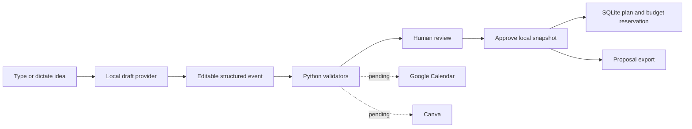

# CoBu Copilot

A working local event-planning workspace: **Create → edit → Validate → approve locally.** AI event drafting and flyer artwork use the OpenAI API, and Google Calendar availability is optional. Canva design integration remains deferred.

## Why this exists

When I was a Resident Assistant at NYU, planning hall events involved drafting CoBu proposals in StarRez, writing learning outcomes, managing a small budget, coordinating space and P-card calendars, and creating flyers. The administrative work competed with time spent building community. I built this prototype in September 2026 to explore the tool I wish I had then. It was not built during college, and this project is not affiliated with the university or its systems.

## Working now

- Responsive Create and Validate screens, with every draft field editable.
- Typed ideas and browser dictation where the browser supports Web Speech recognition. Audio may be sent to the browser's speech service; typing and device keyboard dictation remain available.
- OpenAI Structured Outputs turns speech-to-text or typed ideas into editable, schema-checked event fields. Deterministic Python validation still checks dates, program rules, and budgets.
- Structured Pydantic event models and deterministic Python validation.
- Editable residence hall, floor, resident counts, semester dates, and per-semester budgets in Settings; saved events and budgets remain available when switching semesters. Rules, focus areas, locations, event types, and draft templates remain in `config.yaml`.
- AI drafting keeps event descriptions concise, writes three event-specific Bloom-style outcomes, itemizes supplies and unit prices, and keeps supply prices separate from an explicit event spending cap. Attendance defaults to 15% of the configured floor or building population.
- Semester settings persist locally. Switch terms and copy a saved event into a new draft for the selected semester.
- SQLite saved drafts, local proposal approval, budget reservations, and actual spending that replaces estimates.
- Three generated flyer options using the OpenAI image API, with exact event text overlaid by the app, plus local layout previews.
- Approval bound to the exact event, configuration, and budget snapshot. Changes require validation again. Approval never triggers external writes in this version.
- Approved-proposal JSON downloads. Drafts cannot be exported through that endpoint.

## Run locally

Python 3.11+ recommended (tested with Python 3.12).

```sh
python3 -m venv .venv
source .venv/bin/activate
python -m pip install -r requirements.txt
export OPENAI_API_KEY="your-api-key"  # required for AI event drafting and flyer generation
# export COBU_DRAFT_MODEL="gpt-4o-mini"  # optional override
python -m uvicorn app.main:app --host 127.0.0.1 --port 8849
```

Open **http://127.0.0.1:8849/**. Keep the terminal running while using the app. API documentation is at `/api/docs`.

To connect Google Calendar, open **Settings** in CoBu and follow the one-time setup. Save the Google OAuth Desktop client JSON as `credentials.json` in this folder before clicking **Connect Google Calendar**. CoBu requests free/busy access only for your primary calendar.

This is a single-user local app, not an authenticated production service. Keep the listener bound to loopback. State lives in `data/local/`, which is ignored by Git. An optional `COBU_DB_PATH` environment variable changes the database location. AI event drafting and flyer generation require an OpenAI API key in `OPENAI_API_KEY`; API usage is billed separately from a ChatGPT subscription. The idea text is sent to OpenAI when you choose Fill in event. Google Calendar free/busy is optional and requires a Google Cloud project plus a Desktop OAuth client JSON saved as `credentials.json` in this folder. The app checks only your primary calendar and does not book events or reserve rooms. It can open a prefilled Google Calendar event link; review it and press Save in Google Calendar to add the event. No Canva account or Canva Pro plan is required for generated flyer artwork.

## Structure

```text
app/                 FastAPI routes, Pydantic models, SQLite, web UI
agents/              OpenAI structured event drafter and legacy local parser
validators/          Deterministic proposal, schedule-rule, and budget checks
connectors/          Typed boundaries for future AI, calendar, and Canva adapters
config.yaml          Editable domain rules and template defaults
data/sample/         Fictional evaluation prompts only
tests/               Validator, budget, approval, and API boundary tests
docs/                Demo flow and integration handoff
```



## Tests and measurement

```sh
python -m pip install -r requirements-dev.txt
python -m pytest -q
```

The implemented test suite covers blocked-window boundaries, weak outcomes, wrong counts, collaboration rules, semester rollover, Floor Engagement windows, budget math, stale approvals, repeated submissions, invalid monetary inputs, and local API boundaries. See `docs/VALIDATION.md` for the actual observed test result.

`data/sample/eval_ideas.json` contains ten fictional ideas for a future model evaluation. **No AI pass-rate measurement has been run.** A template test is not an LLM evaluation, and no measured time saving is claimed. After the real provider is added, preserve each first response and count first-try validator passes separately from repaired results.

## Current limits and next work

- The draft provider is template/rule based, not a connected AI event-planning agent. Arbitrary ideas use a generic starter; inspect the suggested text and replace unknown supplies. Configured defaults are explicitly suggestions.
- Calendar free/busy checks only the connected account's primary calendar. P-card and room calendars, reservations, and complete six-week scheduling are not implemented. A local approval is not a confirmed booking.
- Canva OAuth and template mapping are not implemented. Generated flyers use OpenAI image API artwork with event text added by CoBu; they are not editable Canva designs.
- SMART checks recognize action verbs, measurable wording, and time markers. They cannot establish relevance, attainability, or semantic quality; human review is required.
- The current editor handles single, same-day events. Weekly cadence is checked against approved peers, but generating a six-week recurring series is deferred.
- Shopping quantities/prices are estimates. Purchase source and optional links are editable; Amazon Excel export and post-event evaluation drafting remain next steps.
- Dictation depends on browser support and permission. No microphone recording is stored by the app. Live microphone capture has not been tested here.
- API checks protect a loopback workspace, not a multi-user public service. Public hosting requires app authentication and proper OAuth callbacks.

See `docs/CONNECTORS.md` for the next integration steps and `docs/DEMO.md` for an honest five-minute walkthrough. Source is prepared for a public GitHub repository, but this local build has not been published there.

Local Git is initialized, but commits are pending a configured Git author name and email. No author identity was invented or set globally.
